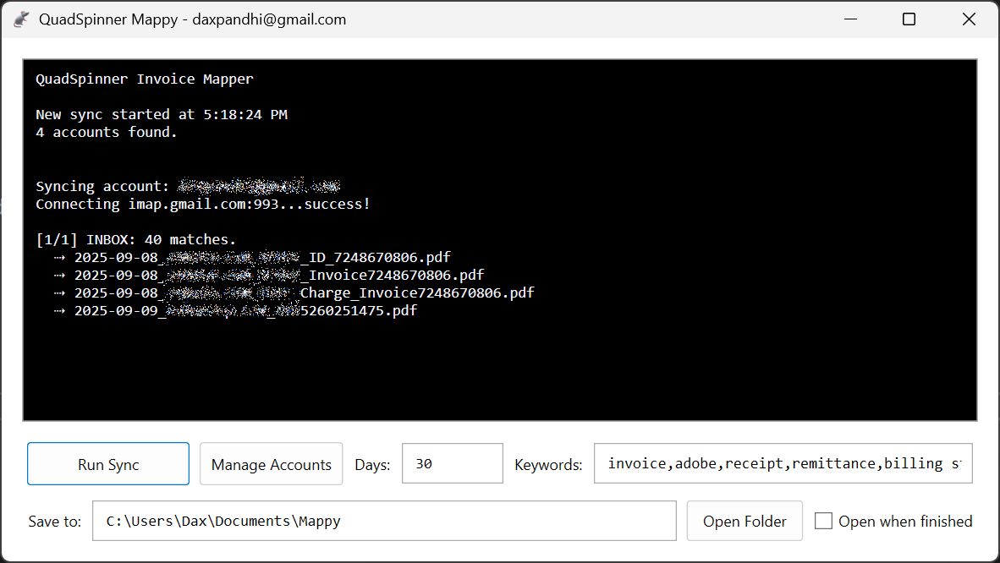

# Mappy: Email PDF Harvester

Small WPF utility that logs into IMAP accounts, searches recent mail by subject keywords, and saves PDF attachments into month-based folders. Passwords are stored encrypted (DPAPI). Accounts are managed via a built-in dialog.




---

## Features

* Manage all your email accounts in one place—add, edit, or delete. A blank row is ready so you can start typing right away.
* Store per-account settings (Host, Port, SSL, Username, Password, Keywords, Folders) in your profile at `%AppData%\Mappy\email_account.json`.
* Your password is encrypted with your Windows login and handled automatically—no extra steps.
* Keep a single list of global keywords (comma-separated) that apply to every account, saved at `%AppData%\Mappy\keywords.txt`.
* Click **Sync** to scan Inbox and chosen folders from the last *N* days for subject matches, and save PDF attachments into `SavedPDFs/YYYY-MM`.
* Optionally require the PDF’s text to contain your keywords to reduce false positives.
* See live progress and results in the on-screen log.

---

## Quick start

1. **Install NuGet packages**

   * `MailKit`, `MimeKit`, `itext7` (Kernel).
2. **Run → Accounts…** Add an account, set folders/keywords, **Save**. (Dialog loads existing store and creates a starter row if empty.) 
3. **Global keywords**: type into the main window textbox (comma-separated). They are auto-loaded/saved to `%AppData%\Mappy\keywords.txt`. 
4. **Sync**: enter days (default ~3) and click **Sync**. PDFs land in `SavedPDFs/YYYY-MM`.  

---

## How it works (high-level)

* **Storage**
  `EmailAccountStore` persists JSON under `%AppData%\Mappy\email_account.json`. Each `EmailAccount` holds encrypted password and lists of `Keywords` / `Folders`.   

* **Encryption**
  DPAPI `ProtectedData` with app entropy; `EmailAccount.Password` wraps `EncryptedPassword`.  

* **Sync flow**
  For each account: merge **account keywords** + **global keywords**; connect IMAP; open Inbox and configured folders; search `DeliveredAfter(period) AND (SubjectContains any keyword)`; save PDF attachments into `SavedPDFs/YYYY-MM`.    

* **Attachment filtering**
  When keywords exist, PDFs are written to a temp file, text-extracted with iText, checked for any keyword match, then saved (else skipped).  


## Key Details

* **Account manager dialog** (add/edit/delete; always has a draft row for immediate editing).  
* **Per-account settings:** `host`, `port`, `useSsl`, `username`, `password (encrypted)`, `keywords[]`, `folders[]`. Stored at `%AppData%\Mappy\email_account.json`.  
* **DPAPI-encrypted passwords** (CurrentUser; transparent through `EmailAccount.Password`).  
* **Global keywords** (comma-separated, persisted to `%AppData%\Mappy\keywords.txt`). 
* **IMAP sync** across Inbox + optional folders; search last *N* days (UI) for subject keyword hits; save **PDF** attachments to `SavedPDFs/YYYY-MM`.    
* **Optional PDF content check**: if keywords provided, PDFs are text-scanned before saving (iText 7).  
* **On-screen log** via `Guts.Notify`. 

---

## UI bits

* **Accounts dialog** binds the right pane to `Selected.*` and pushes PasswordBox → VM via `PasswordChanged`. A draft account is auto-added if none exist.  
* **Open the dialog** from the main window. 

---

## Paths

* Accounts JSON: `%AppData%\Mappy\email_account.json` (helper: `EmailAccountStore.GetPath`) 
* Global keywords: `%AppData%\Mappy\keywords.txt` (auto-load/save). 
* Output PDFs: `SavedPDFs/<YYYY-MM>/...` (relative to working dir).  

---

## Minimal code sample

```csharp
// Open the Accounts dialog
new EmailAccountsDialog { Owner = this }.ShowDialog();  // loads/saves store

// Kick off a run (see MainWindow.RunSync for full impl.)
await Guts.GetMessages(host, port, useSsl, user, pass, days, keywords, folders);
```

(See `MainWindow.RunSync` for merging global + per-account keywords and UI plumbing.) 

---

## Roadmap / TODO

* Sanitize filenames for invalid path chars before saving.
* Use `SecureSocketOptions.Auto` + reasonable timeouts.
* Gracefully skip missing folders (try/catch) and add “Test connection / Fetch folders” UX.

---

## Dependencies

* **MailKit / MimeKit** (IMAP + MIME)
* **iText 7** (Kernel) for PDF text extraction

---

## License

Licensed under the permissive [MIT License](LICENSE.txt).


## Additional Credits

Mouse Icon courtesy of Icons8

[Mouse Animal](https://icons8.com/icon/PlxnotwI57JG/mouse-animal) icon by [Icons8](https://icons8.com)